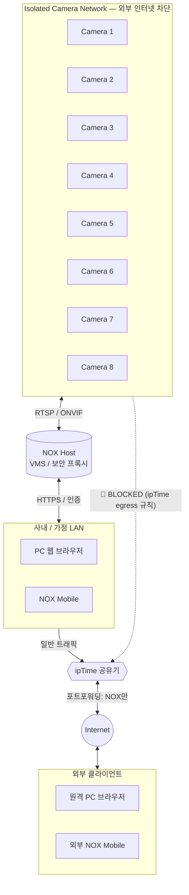

# 중국산 IP카메라 보안, ipTime 인터넷 차단으로 격리하고 NOX VMS로 안전하게 쓰는 법

**중국산 IP카메라 보안**은 더 이상 미룰 수 없는 숙제가 되었습니다. 2024년 9월, 한국의 산부인과·왁싱숍·룸카페·펜션 수영장에 설치된 IP카메라 영상이 중국 음란 사이트와 텔레그램으로 유출됐다는 보도가 잇따랐습니다. 보안뉴스는 텔레그램에 노출된 한국 사생활 영상이 [약 4,500개에 달한다고 단독 보도](https://m.boannews.com/html/detail.html?idx=125342)했고, 네이트뉴스는 같은 시기 [중국 사이트에서 800개 이상 확인](https://news.nate.com/view/20240930n08225)됐다고 전했습니다.

이 글은 카메라를 다 갈아치우라는 글이 아닙니다. **이미 설치된 IP카메라를 그대로 두면서, 오늘 30분으로 해킹 위험을 크게 낮추는 IP카메라 해킹 방지 실전 가이드**입니다. 핵심은 두 가지—(1) **ipTime 외부 IP 차단** 기능으로 카메라 인터넷 접속을 끊고, (2) **NOX VMS**를 단일 진입점(보안 프록시)으로 두는 것입니다.

## 1. 왜 "비밀번호만 바꾸면 안전"이 아닌가 — 중국산 IP카메라 보안의 본질

사고 보도는 보통 "초기 비밀번호 미변경"으로 결론납니다. 하지만 국내 IP카메라의 [약 80%가 중국산](https://industryjournal.co.kr/news/239538)이고, 이 제품들은 출입문 외에 **여러 옆문**을 열어둔 채 출하되기 때문에 비밀번호만으로는 부족합니다.

카메라가 인터넷으로 내보내는 트래픽은 크게 세 갈래입니다.

- **P2P 클라우드 텔레메트리** — XMEye, Hik-Connect, Dahua P2P는 카메라 전원이 켜지자마자 제조사 클라우드로 항상-연결을 유지합니다. [XMEye는 모든 통신이 미암호화](https://sec-consult.com/blog/detail/millions-of-xiongmai-video-surveillance-devices-can-be-hacked-via-cloud-feature-xmeye-p2p-cloud/)이며 펌웨어 업데이트마저 평문이라 중간자 공격에 취약합니다. **XMEye 위험성**은 보안 업계가 수년째 경고해 온 사안입니다.
- **펌웨어 백도어/RCE** — **Hikvision 백도어**의 대표 사례인 [CVE-2021-36260](https://ipvm.com/reports/hikvision-36260)은 인증 없이 루트 권한을 가져가는 취약점으로, 영향 기기가 **1억 대 이상**이고 [Moobot 봇넷이 적극 활용](https://www.fortinet.com/blog/threat-research/mirai-based-botnet-moobot-targets-hikvision-vulnerability)했습니다. 패치 1년 뒤에도 [8만 대 이상이 미패치](https://www.theregister.com/2022/08/24/hikvision_camera_patch/) 상태였습니다. 최근엔 Xiongmai XM530의 [CVE-2025-65856 (ONVIF 인증 우회, CVSS 9.8)](https://github.com/LuisMirandaAcebedo/CVE-2025-65856)이 보고됐습니다.
- **ONVIF/RTSP 무방비 노출** — 포트포워딩 한 번이면 영상이 그대로 인터넷에 떠다닙니다. Shodan에 [무방비 RTSP 카메라 8,373대 이상이 노출](https://cybernews.com/editorial/thousands-unprotected-security-cameras-surveilling-world/)된 상태입니다.

미국은 [FCC Covered List](https://www.fcc.gov/supplychain/coveredlist)로 신규 인증을 막았고, 영국은 [민감 시설에서 단계 교체 중](https://ipvm.com/reports/sensitive-sites-uk)이며, 한국도 [다중이용시설 인증 의무화](https://zdnet.co.kr/view/?no=20241114165647)를 추진합니다. 정부 차원에서도 "그냥 두면 안 된다"는 결론에 도달한 셈입니다.

## 2. 해결 원칙 — CCTV 네트워크 분리로 카메라를 외부 인터넷과 격리하라

IoT 보안 가이드의 공통 권고는 단순합니다. **카메라는 별도 네트워크에 두고, 인터넷 outbound는 기본 차단(default deny)하라.** 이것이 모범 사례로 자리잡은 **CCTV 네트워크 분리**의 핵심 원칙입니다.

이상적인 구성은 카메라 전용 **VLAN/SSID**에 두고 방화벽에서 egress를 막은 뒤 필요한 NTP·DNS만 화이트리스트로 허용하는 것입니다. 하지만 이건 UniFi·pfSense 같은 prosumer 장비가 필요합니다. 다행히 ipTime의 **"인터넷/WiFi 사용 제한"** 은 본질적으로 egress 필터라, VLAN 없이도 "이 IP는 외부 인터넷으로 못 나간다"는 **IP카메라 인터넷 차단** 효과를 만들 수 있습니다.

## 3. 실전 1편 — ipTime 외부 IP 차단으로 카메라 인터넷 끊기

### 3.1 사전 준비: 카메라 내부 IP 고정

규칙은 내부 IP 기준이라 DHCP로 IP가 바뀌면 무력화됩니다. ipTime 관리자(`http://192.168.0.1`) > **고급 설정 > 네트워크 관리 > DHCP 서버 설정**에서 카메라 MAC을 **수동 등록**으로 옮겨두세요. 예시는 `192.168.0.63`(cam1)로 진행합니다.

### 3.2 메뉴 진입과 규칙 추가

**고급 설정 > 보안 기능 > 인터넷/WiFi 사용 제한**으로 이동, **"사용자 고급 설정"** 모드를 선택하고 다음과 같이 입력합니다.

1. **방향**: `내부 → 외부`
2. **규칙 이름**: `cam1-egress-block`
3. **내부 IP 주소**: `192.168.0.63`
4. **외부 목적지**: `ALL`, **모든 외부 IP**
5. **포트**: 비워두기 또는 `ALL`
6. **동작**: `차단`
7. **스케줄**: `매일 24시간`
8. **적용** > **새규칙으로 등록**


규칙이 등록되면 목록에 `cam1` 행이 활성 상태로 나타납니다.


카메라가 여러 대라면 DHCP에서 `192.168.0.60~70` 같은 연속 대역에 몰아 넣고 **IP 범위**로 한 줄에 등록하면 깔끔합니다.

### 3.3 차단 확인

```bash
# LAN 안에서는 살아 있어야 정상
ping 192.168.0.63

# 카메라가 외부로 못 나가는지 (카메라에 curl이 있을 때)
curl -m 5 https://www.google.com
# 결과: 타임아웃이 정상
```

카메라 제조사 앱(XMEye, Hik-Connect 등)에서 "오프라인"으로 뜨면 격리가 적용된 신호입니다.

## 4. egress 차단만으론 부족한 이유

여기까지만 해도 카메라가 중국 서버로 텔레메트리를 보내는 경로는 끊었습니다. 그러나 두 가지 구멍이 남습니다.

**첫째, LAN 내 측면 이동.** egress 차단은 외부로의 통신만 막을 뿐, 같은 LAN의 다른 기기가 카메라에 직접 붙는 경로는 막지 않습니다. 가족 노트북이 감염되면 카메라의 무방비 RTSP/ONVIF로 접근할 수 있습니다.

**둘째, 외부에서 보고 싶을 때.** 카메라마다 포트포워딩은 가장 나쁜 선택입니다. 인증 우회 CVE 하나면 영상이 전 세계에 노출됩니다(앞서 본 Shodan 8,000여 대 사례).

해결은 산업계 표준 패턴입니다. **모든 카메라 접근을 단일 VMS 서버를 통하게 하고, 외부 공개는 그 VMS 한 곳만, TLS와 강한 인증으로** 묶는 것 — [Gateway NVR 패턴](https://help.videoexpertsgroup.com/kb/gateway-nvr)으로 알려진 **VMS 보안 프록시** 아키텍처입니다.

## 5. 실전 2편 — NOX VMS를 보안 프록시로 두는 네트워크 구조



핵심 흐름 세 줄:

- **카메라 8대는 점선 박스 안에 갇혀 있다.** ipTime egress 규칙이 모든 외부 통신을 막아, XMEye·Hik-Connect 같은 P2P 클라우드 신호가 외부로 나갈 수 없습니다.
- **NOX 호스트가 유일한 다리다.** 카메라와는 격리망 안에서 RTSP/ONVIF로, 사용자(PC·NOX Mobile)와는 LAN/HTTPS로 대화합니다.
- **외부 공개는 NOX 한 곳만.** ipTime 포트포워딩을 NOX HTTPS 포트로만 열고, 인증·TLS·로그를 NOX가 책임집니다. 카메라는 인터넷에 한 바이트도 노출되지 않습니다.

## 6. 이 구조가 주는 보안 이점 (체크리스트)

- [x] **카메라 펌웨어가 어떻든 외부 콜백 차단** — 백도어·텔레메트리·악성 펌웨어 업데이트가 모두 막힙니다.
- [x] **단일 진입점 → 보안 일원화** — TLS·사용자 권한·2FA·접근 로그를 NOX 한 곳에서 통제합니다.
- [x] **카메라 추가·교체 시 외부 설정 변경 불필요** — 격리 네트워크에 붙이고 NOX에 등록만 하면 됩니다.
- [x] **사고 시 추적 단순화** — 의심 트래픽 추적은 NOX 접근 로그 한 곳에서 시작합니다.
- [x] **공급망 리스크 대비** — 영국·한국의 규제 흐름에서 "이미 격리해 두었다"는 사실 자체가 향후 감사·점검에 방어선이 됩니다.

## 7. 자주 묻는 질문 (FAQ) — IP카메라 해킹 방지 실무 Q&A

**Q1. P2P 앱(XMEye, Hik-Connect)으로만 봤는데, 차단하면 그 앱이 안 되지 않나요?**
맞습니다. 그게 의도된 결과입니다. 앱이 잘 보였다는 건 카메라가 매 순간 제조사 클라우드와 양방향 연결돼 있었다는 뜻이고, 본 가이드는 정확히 그 연결을 끊기 위한 것입니다. NOX VMS가 같은 역할(원격 보기·알림·녹화)을 단일 인증·TLS 경로로 제공합니다.

**Q2. 포트포워딩 대신 VPN으로 들어와도 되나요?**
더 안전한 옵션입니다. ipTime의 VPN 서버 기능이나 WireGuard로 들어와 NOX에 LAN처럼 붙는 방식은 포트포워딩보다 공격 표면이 줄어듭니다. 다만 직원들이 모두 VPN을 설치·관리해야 하는 운영 부담은 고려해야 합니다.

**Q3. ipTime 말고 다른 공유기에서도 되나요?**
원리는 동일합니다. ASUS·Netgear·TP-Link·통신사 공유기 모두 "Access Control" 또는 "Outbound Firewall" 같은 이름으로 비슷한 기능을 제공합니다. 메뉴 명칭만 다를 뿐 "이 내부 IP의 외부 outbound를 차단"이라는 동작은 같습니다.

**Q4. RTSP/ONVIF를 막으면 NOX도 카메라를 못 보지 않나요?**
NOX는 격리 네트워크 안쪽에서 카메라와 통신합니다. ipTime egress 규칙은 **카메라 → 외부 인터넷** 방향만 막을 뿐, 같은 LAN 안의 NOX → 카메라 통신은 영향받지 않습니다.

## 8. 마무리 — 카메라를 신뢰하지 말고, 네트워크를 신뢰하라

**중국산 IP카메라 보안**의 본질은 "어떤 브랜드를 사느냐"가 아니라 **"카메라가 외부로 무엇을 할 수 있는지를 네트워크가 결정한다"** 는 점입니다. 펌웨어는 미패치·EOL·0-day 같은 변수에 늘 노출되지만, 라우터 규칙은 사용자가 100% 통제할 수 있습니다.

오늘 할 일은 세 줄입니다.

1. 카메라의 내부 IP를 고정한다.
2. ipTime "인터넷/WiFi 사용 제한"으로 그 IP의 외부 통신을 차단한다(= **ipTime 외부 IP 차단**).
3. 외부에서 봐야 한다면 NOX 같은 VMS를 단일 진입점(VMS 보안 프록시)으로 두고, 카메라는 내부에서만 접근한다.

NOX는 이 패턴을 일반 사용자가 따라할 수 있게 만든 도구의 한 예입니다. 어떤 도구를 쓰든 핵심은 **"카메라가 인터넷과 직접 대화하지 않는다"** 는 한 줄을 오늘 실현하는 것입니다.

## 참고 자료

- [국내 IP카메라 80%가 중국산… 해킹 사고 우려↑ — 산업종합저널](https://industryjournal.co.kr/news/239538)
- [중국산 IP캠 설치한 왁싱숍·룸카페, 中 음란사이트에 영상 대량 유출 — 서울신문/네이트](https://news.nate.com/view/20240930n08225)
- [중국 해커, 국내 IP 카메라 해킹... 4,500개 사생활 영상 텔레그램 노출 — 보안뉴스](https://m.boannews.com/html/detail.html?idx=125342)
- [한 가정집 몰카 어디서 나오나 했더니… 정부, IP캠 보안 구멍 막기 — ZDNet Korea](https://zdnet.co.kr/view/?no=20241114165647)
- [IP 카메라 보안 강화 방안 — 대한민국 정책브리핑](https://www.korea.kr/briefing/policyBriefingView.do?newsId=156660546)
- [Hikvision CVE-2021-36260: 1억 대 영향 — IPVM](https://ipvm.com/reports/hikvision-36260)
- [Mirai-based Botnet Moobot Targets Hikvision Vulnerability — Fortinet](https://www.fortinet.com/blog/threat-research/mirai-based-botnet-moobot-targets-hikvision-vulnerability)
- [80,000 Hikvision cameras still vulnerable — The Register](https://www.theregister.com/2022/08/24/hikvision_camera_patch/)
- [Millions Of Xiongmai Devices Hacked Via XMEye Cloud — SEC Consult](https://sec-consult.com/blog/detail/millions-of-xiongmai-video-surveillance-devices-can-be-hacked-via-cloud-feature-xmeye-p2p-cloud/)
- [CVE-2025-65856 Xiongmai XM530 ONVIF 인증 우회](https://github.com/LuisMirandaAcebedo/CVE-2025-65856)
- [FCC Covered List](https://www.fcc.gov/supplychain/coveredlist)
- [UK Defines 'Sensitive Sites' Where PRC Cameras Are Banned — IPVM](https://ipvm.com/reports/sensitive-sites-uk)
- [ipTime 공유기 특정 기기 인터넷 및 와이파이 차단 방법 — 아이티온즈넷](https://itons.net/iptime-%EA%B3%B5%EC%9C%A0%EA%B8%B0-%ED%8A%B9%EC%A0%95-%EA%B8%B0%EA%B8%B0-%EC%9D%B8%ED%84%B0%EB%84%B7-%EB%B0%8F-%EC%99%80%EC%9D%B4%ED%8C%8C%EC%9D%B4-%EC%B0%A8%EB%8B%A8-%EB%B0%A9%EB%B2%95/)
- [ipTIME 공유기를 이용한 특정 IP 차단 — zipi](https://zipi.me/483)
- [Home Network VLANs: Isolate IoT Devices for Security — State of Surveillance](https://stateofsurveillance.org/guides/advanced/home-network-vlans-segmentation/)
- [Gateway NVR — Video Experts Group](https://help.videoexpertsgroup.com/kb/gateway-nvr)
- [VMS vs NVR — Genetec](https://www.genetec.com/blog/products/what-are-the-differences-between-a-vms-and-an-nvr)
- [Thousands of unprotected security cameras spying — Cybernews](https://cybernews.com/editorial/thousands-unprotected-security-cameras-surveilling-world/)
