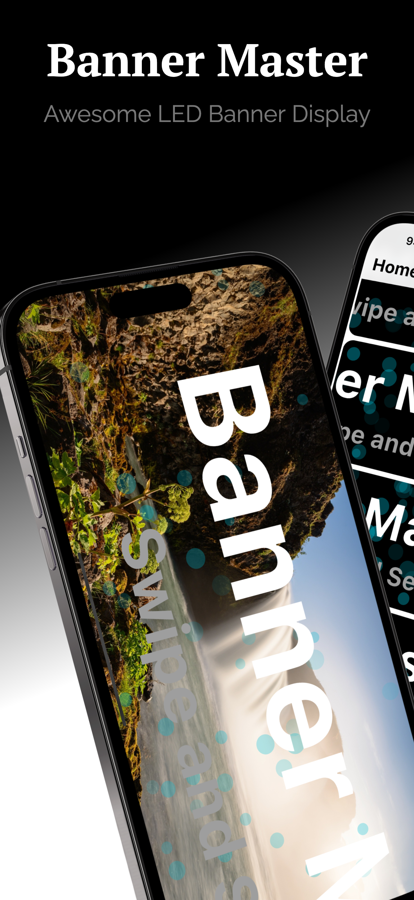
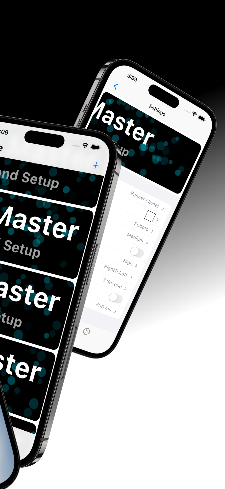
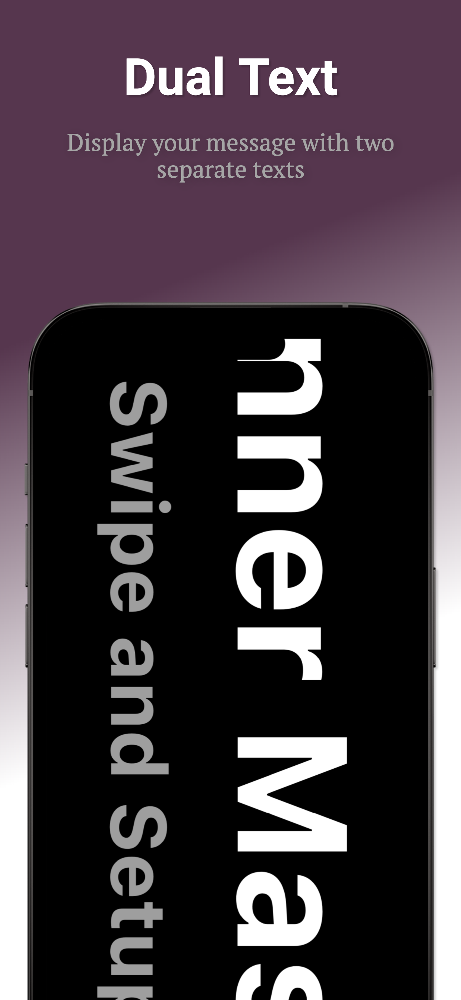
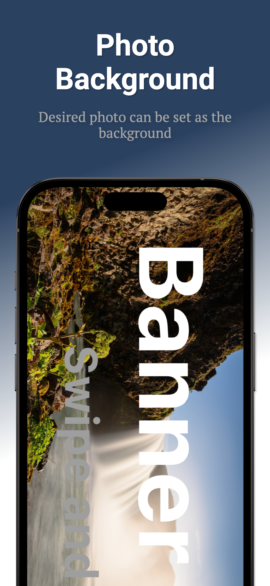
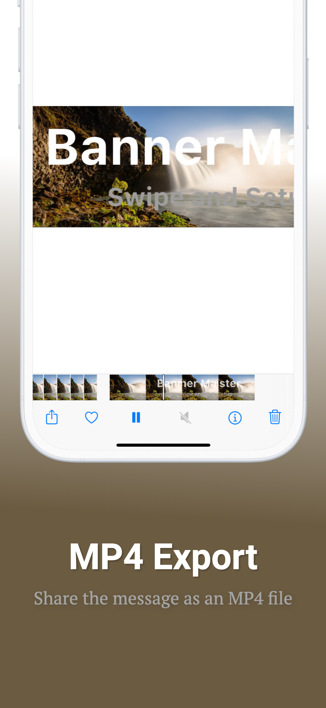
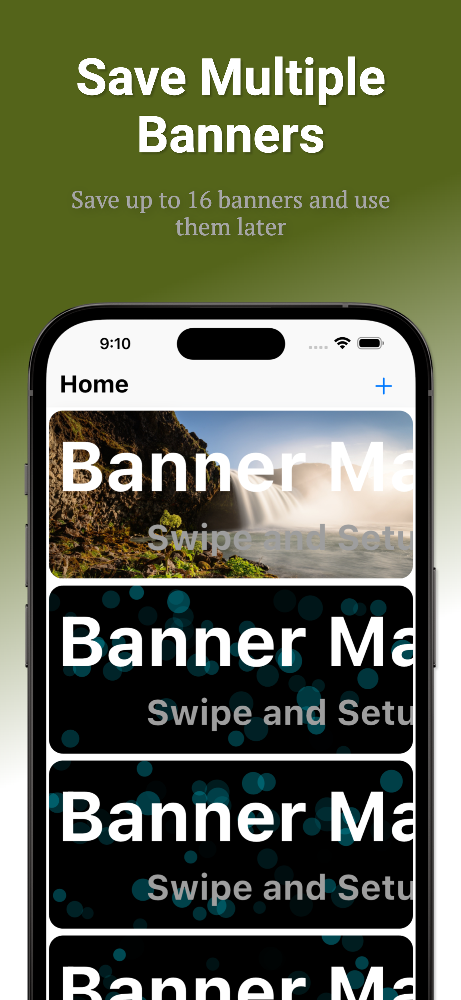
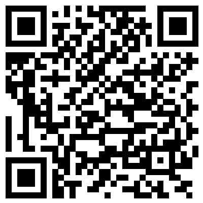

# LED Banner Master - The Ultimate LED Banner App

&nbsp; &nbsp; &nbsp; &nbsp; &nbsp; &nbsp; &nbsp; &nbsp;

 

&nbsp; &nbsp; &nbsp; &nbsp; &nbsp; &nbsp; &nbsp; &nbsp;

GetItOnGooglePlay_Badge_Web_color_English

## Express Yourself with Style and Creativity

Welcome to **LED Banner Master**, the powerful and user-friendly app that lets you create stunning LED banners for any occasion. Whether you want to display a message at an event, advertise your business, or just have fun, **LED Banner Master** has you covered.

### Key Features

- **Primary & Secondary Text Display**: Easily create banners with primary and secondary texts to convey your messages clearly and effectively.
- **Image Backgrounds**: Customize your banners with beautiful images backgrounds for a unique and eye-catching display.
- **Various Effects**: Add excitement to your banners with a wide range of effects, from scrolling text to flashing animations.
- **MP4 Export**: Export your creations as MP4 videos to share on social media, your website, or anywhere else.

---

## Why Choose LED Banner Master?

- **Free to Use**: Enjoy all the essential features without paying a dime. We've kept the app free, with minimal ads to ensure your user experience is top-notch.
- **Ad-Free Experience**: Want to remove ads and unlock special features? You can do so with an In-App purchase, giving you even more creative control.

---

## How It Works

1. **Download and Install**: Available on both iOS and Android, get started with LED Banner Master in minutes.
2. **Create Your Banner**: Use our intuitive interface to design your banner with text, images, and effects.
3. **Customize & Export**: Add a background, choose your effects, and export your masterpiece as a GIF or MP4.
4. **Share & Display**: Whether it's at a party, on a website, or for an ad campaign, show off your LED Banner Master creation to the world.

---

## Screenshots

Take a look at what you can create with LED Banner Master.

---

## Get Started Today

Ready to make your messages stand out? Download LED Banner Master now and start creating!

&nbsp; &nbsp; &nbsp; &nbsp; &nbsp; &nbsp; &nbsp; &nbsp;

&nbsp; &nbsp; &nbsp; &nbsp; &nbsp; &nbsp; &nbsp; &nbsp;

---

## Contact Us

Have any questions or feedback? [Contact us](mailto:yiyolcorp@gmail.com) – we'd love to hear from you!
